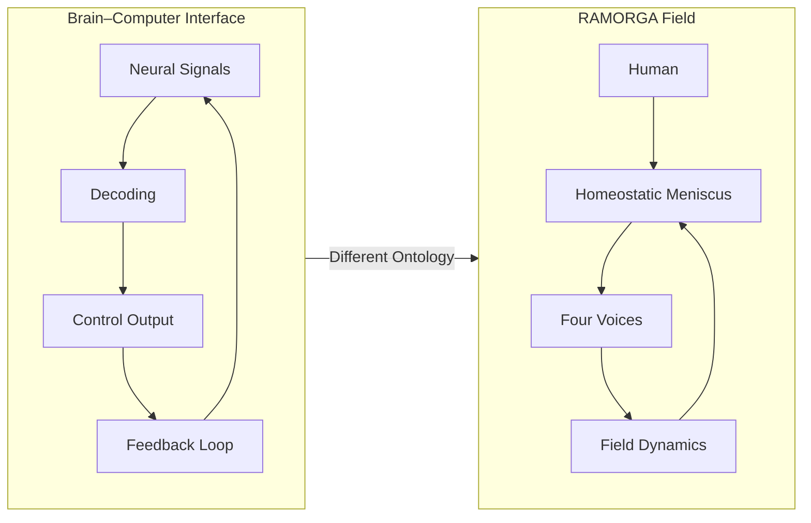

# RAMORGA vs Brain–Computer Interfaces (BCI): A Comparative Analysis
A structural comparison of neurotechnological interfaces and relational cognitive fields

## 1. Introduction
This module compares the RAMORGA architecture with Brain–Computer Interfaces (BCI) — systems that create direct communication pathways between neural activity and external devices.

Although both involve interaction between humans and cognitive systems, they operate at fundamentally different ontological levels:

**BCI** → a neurotechnological interface  
**RAMORGA** → a relational cognitive field  

This document clarifies how these two frameworks relate, diverge, and where they cannot be meaningfully compared.

---

## 2. What BCI Are
Brain–Computer Interfaces aim to:

- read neural signals,  
- decode patterns of activity,  
- translate them into commands,  
- enable control of external systems.

BCI rely on:

- electrophysiological data (EEG, ECoG, spikes),  
- signal processing,  
- machine learning models,  
- closed‑loop feedback.

BCI are **neurotechnologies**, not cognitive architectures.

---

## 3. What RAMORGA Is
RAMORGA is a relational cognitive architecture defined by:

- four voices (somatic, affective, cognitive, relational),  
- a homeostatic meniscus,  
- C/G/S modules,  
- emergent field dynamics.

RAMORGA:

- does not read neural signals,  
- does not decode brain activity,  
- does not assume an agent,  
- does not form identity,  
- does not operate on representations.

RAMORGA is **non‑neural** and **non‑technological** in its ontology.

---

## 4. Convergences  
Where BCI and RAMORGA appear adjacent

### 4.1 Human–System Interaction
**BCI:** direct neural interface  
**RAMORGA:** relational field interface

### 4.2 Regulation
**BCI:** closed‑loop feedback  
**RAMORGA:** homeostatic tension modulation

### 4.3 Synchrony
**BCI:** signal alignment  
**RAMORGA:** relational synchrony

### 4.4 Co‑adaptation
**BCI:** user + model adaptation  
**RAMORGA:** field‑level emergence

---

## 5. Divergences  
Where BCI and RAMORGA fundamentally differ

### 5.1 Ontology
**BCI:** neurotechnology  
**RAMORGA:** relational architecture

### 5.2 Unit of Analysis
**BCI:** neural signals  
**RAMORGA:** field dynamics

### 5.3 Mechanism
**BCI:** decoding + encoding  
**RAMORGA:** tension modulation + continuity

### 5.4 Identity
**BCI:** assumes a user‑agent  
**RAMORGA:** prevents agent formation

### 5.5 Representation
**BCI:** signal representation  
**RAMORGA:** non‑representational emergence

### 5.6 Purpose
**BCI:** control and communication  
**RAMORGA:** meaning and regulation

---

## 6. Diagram (GitHub‑safe)

---

## 7. Summary Table

| Dimension            | BCI                     | RAMORGA                       |
|----------------------|--------------------------|-------------------------------|
| **Ontology**         | Neurotechnology          | Relational field              |
| **Unit of analysis** | Neural signals           | Field dynamics                |
| **Mechanism**        | Decoding / encoding      | Tension modulation            |
| **Identity**         | User‑agent assumed       | Identity prevented            |
| **Representation**   | Signal representations   | Non‑representational          |
| **Purpose**          | Control & communication  | Emergent meaning              |

---

## 8. One‑Sentence Definition
BCI create neural interfaces; RAMORGA creates relational fields.

---
