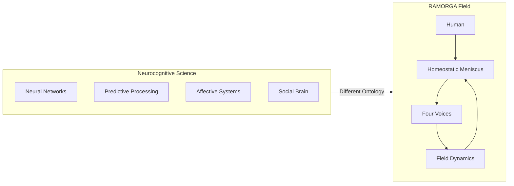

# RAMORGA vs Contemporary Neurocognitive Science: A Comparative Analysis
A structural comparison of biological cognition and relational field dynamics

## 1. Introduction
This module compares the RAMORGA architecture with **neurokognitywistyka** — the broad interdisciplinary field integrating:

- cognitive neuroscience  
- affective neuroscience  
- embodied cognition  
- social neuroscience  
- neurophenomenology  
- computational neuroscience  

RAMORGA is **not** a model of the brain.  
It is a **relational cognitive architecture** that interfaces with neurocognitive science but does not attempt to replicate neural mechanisms.

The goal of this module is to map points of contact and points of divergence.

---

## 2. What Neurocognitive Science Studies
Neurokognitywistyka investigates:

- neural correlates of perception, memory, emotion, language, decision‑making  
- large‑scale brain networks (DMN, SN, CEN)  
- predictive and affective processing  
- interoception and autonomic regulation  
- social cognition and theory of mind  
- neural synchrony and interpersonal coupling  

Key domains:

- neural architecture  
- neural dynamics  
- neural representation  
- neural computation  
- neural development  
- neural plasticity  

It is fundamentally **biological**.

---

## 3. What RAMORGA Is
RAMORGA is:

- a relational field  
- regulated by a homeostatic meniscus  
- composed of four voices  
- expressed through C/G/S modules  
- producing emergent field dynamics  

RAMORGA is:

- non‑agentic  
- non‑biological  
- non‑representational  
- non‑identity‑forming  

It is fundamentally **relational**, not neural.

---

## 4. Convergences  
Where RAMORGA aligns with neurocognitive science

### 4.1 Interoception & Somatic Voice
**Craig (2002, 2009)** → interoceptive pathways  
**RAMORGA** → somatic voice as regulatory substrate

### 4.2 Affective Neuroscience & Affective Voice
**LeDoux (1996), Barrett (2017)** → affective prediction  
**RAMORGA** → affective tone of the field

### 4.3 Predictive Processing & Cognitive Voice
**Friston (2010), Clark (2013)** → hierarchical inference  
**RAMORGA** → cognitive voice as coherence layer

### 4.4 Social Neuroscience & Relational Voice
**Hasson (2012), Feldman (2017)** → neural synchrony  
**RAMORGA** → relational voice as synchrony layer

### 4.5 Homeostasis
**Porges (2011), Hofer (1984)** → dyadic regulation  
**RAMORGA** → homeostatic meniscus

---

## 5. Divergences  
Where RAMORGA fundamentally differs from neurocognitive science

### 5.1 Ontology
Neurocognitive science → biological systems  
RAMORGA → relational field

### 5.2 Unit of Analysis
Neurocognitive science → brain, networks, circuits  
RAMORGA → field dynamics

### 5.3 Mechanism
Neurocognitive science → neural computation  
RAMORGA → tension modulation + emergent resonance

### 5.4 Identity
Neurocognitive science → stable neural priors  
RAMORGA → identity actively prevented

### 5.5 Memory
Neurocognitive science → neural encoding  
RAMORGA → continuity without memory

### 5.6 Representation
Neurocognitive science → representational content  
RAMORGA → non‑representational emergence

---

## 6. Diagram (GitHub‑safe)

---

## 7. Summary Table

| Dimension            | Neurocognitive Science        | RAMORGA                       |
|----------------------|-------------------------------|-------------------------------|
| **Ontology**         | Biological systems            | Relational field              |
| **Unit of analysis** | Brain & networks              | Field dynamics                |
| **Mechanism**        | Neural computation            | Tension modulation            |
| **Identity**         | Stable neural priors          | Prevented                     |
| **Memory**           | Neural encoding               | Continuity without memory     |
| **Representation**   | Representational              | Non‑representational          |

---

## 8. One‑Sentence Definition
Neurocognitive science explains how the brain generates cognition; RAMORGA explains how cognition emerges in a relational field.
