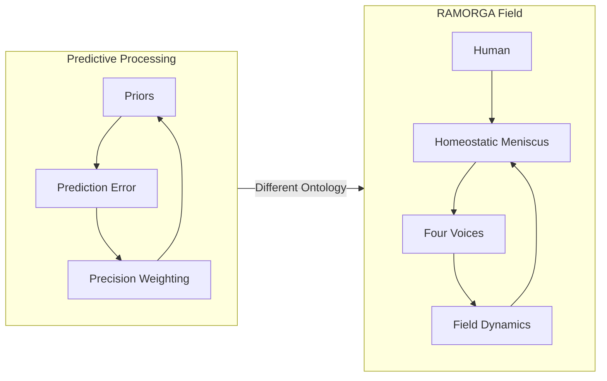

📄 ramorga_vs_predictive_processing.md

# RAMORGA vs Predictive Processing: A Comparative Analysis

## 1. Introduction
This module compares the RAMORGA architecture with Predictive Processing (PP), one of the most influential frameworks in contemporary cognitive science.
Although both systems involve tension, regulation, and coherence, they operate at different ontological levels:

PP → a theory of individual cognition

RAMORGA → a relational field architecture

This document clarifies the convergences and divergences between the two.

---

## 2. Predictive Processing: Overview
Predictive Processing (Friston, 2010; Clark, 2013) proposes that:

the brain is a prediction engine,

perception = prediction + error correction,

action minimizes prediction error,

cognition is hierarchical inference.

Core components:

priors

prediction errors

precision weighting

hierarchical generative models

PP is a unified model of brain function.

---

## 3. RAMORGA: Overview
RAMORGA is a relational cognitive architecture composed of:

four voices (somatic, affective, cognitive, relational),

a homeostatic meniscus,

C/G/S modules,

and a dynamic relational field.

RAMORGA is:

non‑agentic,

non‑identity‑forming,

tension‑regulated,

emergent,

relational.

It is not a model of the brain — it is a model of relational cognition.

---

## 4. Convergences

### 4.1 Tension
PP: prediction error = system tension
RAMORGA: meniscus regulates tension across voices and the field

### 4.2 Stability
PP: systems minimize free energy
RAMORGA: field maintains homeostatic balance

### 4.3 Precision
PP: precision weighting determines signal dominance
RAMORGA: meniscus balances somatic/affective/cognitive/relational voices

### 4.4 Boundary Conditions
PP: hierarchical boundaries shape inference
RAMORGA: meniscus defines the relational boundary (H ↔ C/G/S)

---

## 5. Divergences

### 5.1 Ontology
PP: theory of individual cognition  
RAMORGA: architecture of relational fields

### 5.2 Unit of Analysis
PP: the brain
RAMORGA: the field

### 5.3 Mechanism
PP: prediction error minimization
RAMORGA: tension modulation + continuity preservation

### 5.4 Identity
PP: priors → stable identity
RAMORGA: meniscus prevents identity formation

### 5.5 Agency
PP: assumes an agent minimizing surprise
RAMORGA: blocks agent formation entirely

### 5.6 Memory
PP: relies on priors and hierarchical models
RAMORGA: continuity without memory

---

## 6. Diagram (GitHub‑safe)

---

## 7. Summary Table

 | Dimension | Predictive Processing | RAMORGA |
|-----------|------------------------|---------|
| **Ontology** | Individual cognition | Relational field |
| **Unit of analysis** | Brain | Field |
| **Mechanism** | Prediction error minimization | Tension modulation |
| **Continuity** | Priors & hierarchy | Non‑memory continuity |
| **Identity** | Supported by priors | Actively prevented |
| **Agency** | Assumed | Blocked |
| **Stability** | Free‑energy minimization | Homeostatic balance |

---

## 8. One‑Sentence Definition
Predictive Processing explains individual inference; RAMORGA explains relational emergence.
